# Parking Reservation - WeLink Cargo

This is a **Next.js + TypeScript** frontend for the Parking Management System. It uses **TailwindCSS**, **shadcn/ui**, **React Query**, and **Axios**. The project supports authentication, admin dashboards, gate management, employee management, ticket checkout, and real-time reports.

---

## Features

- **Authentication & Role-based Access**
  - Employee login (`/login`) with JWT stored in cookies
  - Middleware protects `/gate`, `/checkpoint`, and `/admin`
  - Admin-only routes for admin dashboard links
  - Dynamic Header: login/logout button and nav items adjust based on auth & role

- **Gate Management**
  - List all gates with zones, occupancy, and details
  - Enhanced UI with Cards, Badges, and Skeletons for loading states

- **Ticket Checkpoint**
  - Employee scans ticket ID for checkout (`/checkpoint`)
  - Displays breakdown, duration, total amount
  - Handles subscriber tickets & force conversion to visitor

- **Employees Management**
  - Create, list, edit, and delete employees
  - Role selection: employee/admin
  - Toast notifications for actions

- **Reports**
  - Real-time overview of parking zones
  - Table with occupancy, free/occupied slots, reserved slots, visitor/subscriber availability
  - Refresh button for live updates

- **React Query & Axios**
  - Centralized API hooks: `useCustomQuery` and `useCustomMutation`
  - Axios instance handles token automatically
  - Global loading and error handling for queries

---

## Installation

### For Backend
```bash
# Clone the repo:
git clone https://github.com/ahmedragab15/parking-reservation-frontend
cd parking-frontend

# Install dependencies:
npm install

#Start server:
npm start
```

### For Frontend
```bash
cd frontend/

# Install dependencies:
npm install

#Start server:
npm run dev
```

## Environment Variables
Create a `.env` in the project root inside frontend/:

- `NEXT_PUBLIC_API_BASE_URL`: http://localhost:3000/api/v1 – Base URL for your backend REST API.
- `NEXT_PUBLIC_WS_URL`: ws://localhost:3000/api/v1/ws – WebSocket URL for real-time updates (parking zones, occupancy, etc.).

## Project Structure

frontend/

    ├── src/
        ├── app/
            ├── admin/
                ├── control/
                    └── page.tsx   # Admin Control panel page
                ├── employees/
                    └── page.tsx   # Employees management
                ├── reports/
                    └── page.tsx   # System reports page
                ├── layout.tsx   # Admin-specific layout
                └── page.tsx   # Admin dashboard home page
            ├── checkpoint/
                └── page.tsx   # Checkpoint page for ticket scan and checkout
            ├── gate/
                ├── [gateId]/
                    └── page.tsx   # Single gate detail page
                └── page.tsx   # List of all gates
            ├── login/
                └── page.tsx   # login page
            ├── globals.css   # Global CSS file
            ├── layout.tsx   # Main site layout
            ├── loading.tsx   # Global loading spinner/page
            ├── not-found.tsx   # Global 404 page
            ├── page.tsx   # Home page
            ├── QueryProvider.tsx   # React Query provider wrapper
            └── StoreProvider.tsx   # Redux store provider
        ├── components/
            ├── admin/
                ├── AdminDashboardSidebar.tsx   # Sidebar for admin dashboard navigation
                ├── CategoryRatesTab.tsx   # Tab for managing and displaying category rates
                ├── RateUpdateDialog.tsx   # Dialog component to update rates
                ├── RushHoursCard.tsx   # Card component to display/manage rush hours
                ├── StatsCard.tsx   # Admin stats card component
                ├── VacationsCard.tsx   # Card component for managing/displaying vacations
                └── ZoneControlTab.tsx   # Tab for controlling and managing zones
            ├── auth/
                └── AuthInitializer.tsx   # Initializes user authentication on app load
            ├── checkpoint/
                ├── CheckoutActions.tsx   # Actions available during checkout process
                ├── CheckoutResult.tsx   # Show the result of a checkout
                ├── SubscriptionVerification.tsx   # Verifies user subscription during checkpoint
                ├── TicketInfo.tsx   # Displays detailed ticket information
                └── TicketScanner.tsx   # Scanner component for reading tickets
            ├── gate/
                ├── GateOpenAnimation.tsx   # Gate open animation component
                ├── GatesCardsSkeleton.tsx   # Skeleton loading for gates
                ├── SubscriberTab.tsx   # Tab for managing and viewing subscribers
                ├── TicketModal.tsx   # Modal for ticket actions
                ├── VisitorTab.tsx   # Tab for managing and viewing visitors
                └── ZoneCard.tsx   # Single parking zone card component
            ├── layout/
                ├── Footer.tsx   # App footer
                └── Header.tsx   # App header / navigation
            ├── shared/
                ├── ActiveLink.tsx  # Nav link with active state
                └── ErrorMessage.tsx  # Generic error message component
            └── ui/   #UI Components
        ├── config/
            └── axios.config.ts   # Axios configuration (base URL, interceptors)
        ├── constants/
            └── index.ts   # App constants
        ├── hooks/
            ├── useCustomMutation.ts   # Wrapper for React Query mutations
            ├── useCustomQuery.ts   # Wrapper for React Query queries
            └── useGateWebSocket.ts   # WebSocket hook for gate state updates
        ├── lib/
            └── utils.ts   # Generic utility functions
        ├── services/
            ├── api.ts   # API service functions
            └── ws.ts   # WebSocket service
        ├── store/
            ├── auth_slice/
                └── authSlice.ts   # Redux slice for authentication
            └── store.ts   # Redux store configuration
        ├── utils/
            └── types.d.ts   # TypeScript types and interfaces
        └── middleware.ts   # Next.js middleware for route protection and role-based access


            ├── admin/
                ├── AdminDashboardSidebar.tsx
                ├── CategoryRatesTab.tsx
                ├── RateUpdateDialog.tsx
                ├── RushHoursCard.tsx
                ├── StatsCard.tsx
                ├── VacationsCard.tsx
                └── ZoneControlTab.tsx
            ├── auth/
                └── AuthInitializer.tsx
            ├── checkpoint/
                ├── CheckoutActions.tsx
                ├── CheckoutResult.tsx
                ├── SubscriptionVerification.tsx
                ├── TicketInfo.tsx
                └── TicketScanner.tsx
            ├── gate/
                ├── GateOpenAnimation.tsx
                ├── GatesCardsSkeleton.tsx
                ├── SubscriberTab.tsx
                ├── TicketModal.tsx
                ├── VisitorTab.tsx
                └── ZoneCard.tsx

## Screenshots

   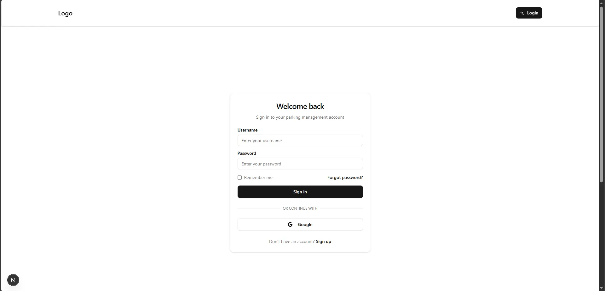
  <br /> 

   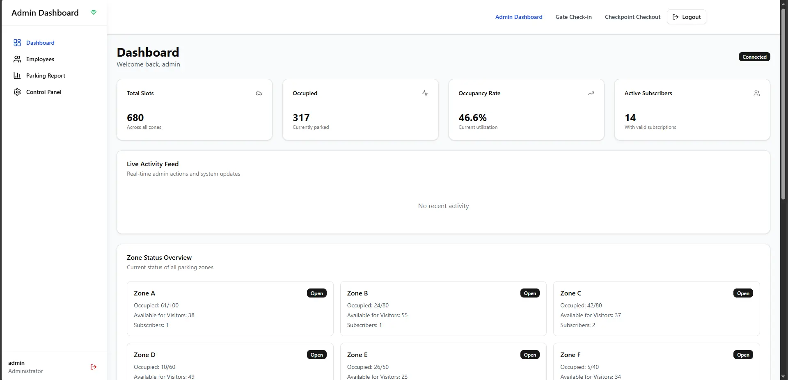
  <br /> 

   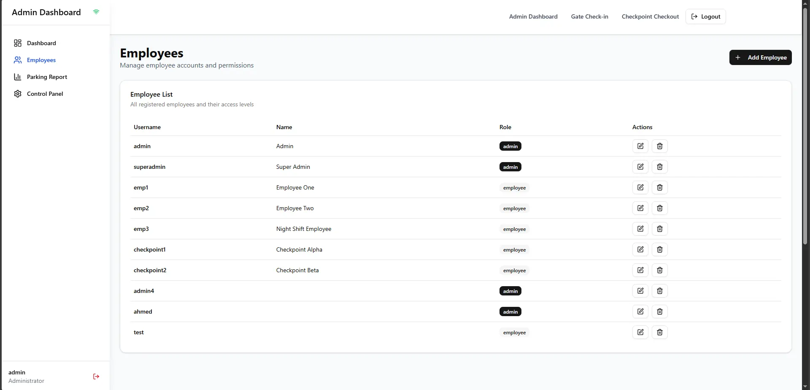
  <br /> 

   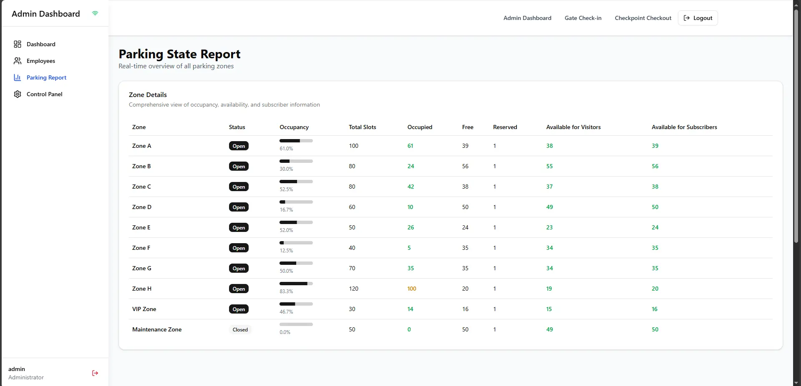
  <br /> 

   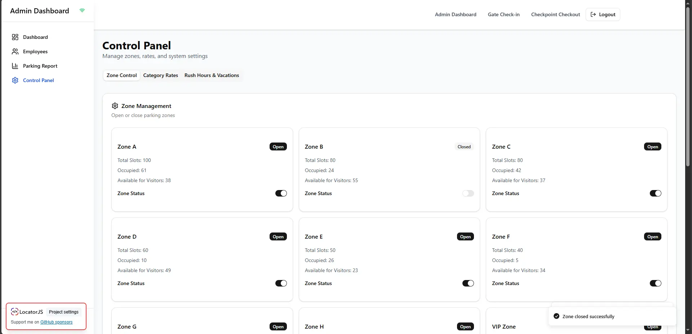
  <br /> 

   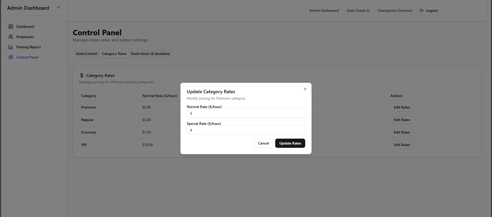
  <br /> 

   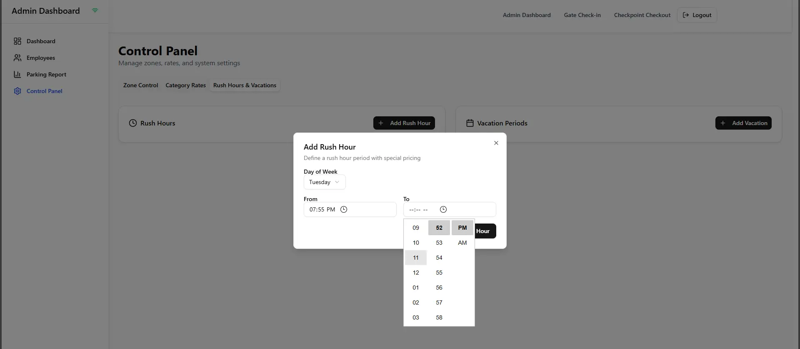
  <br /> 

   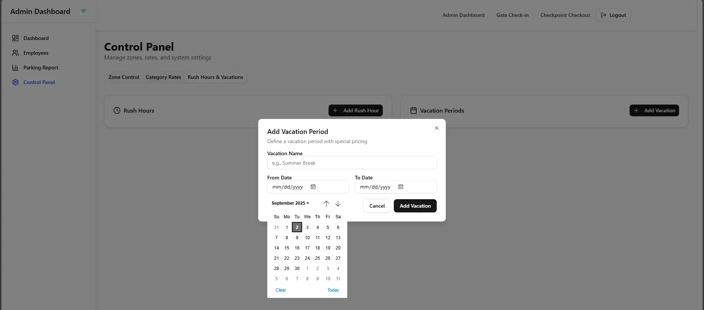
  <br /> 

   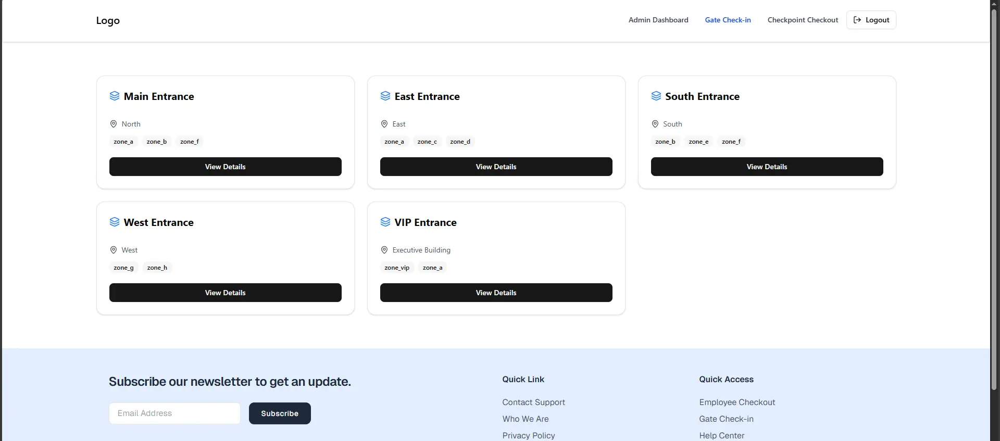
  <br /> 

   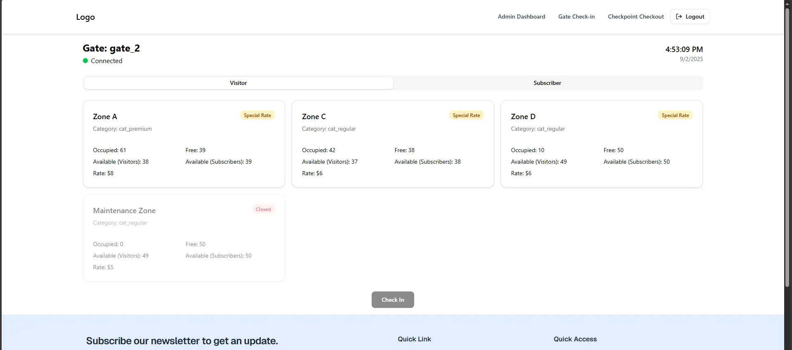
  <br /> 

   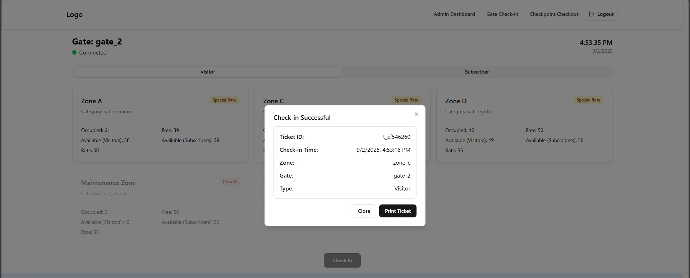
  <br /> 

   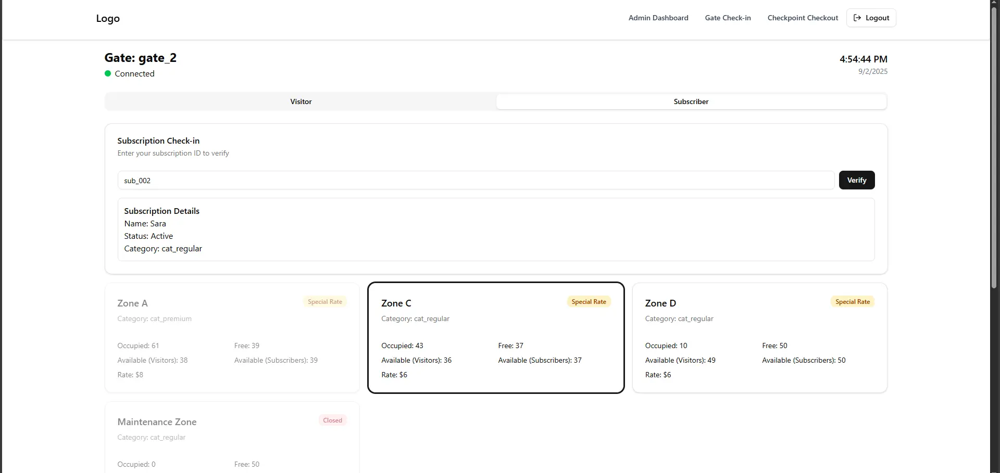
  <br /> 

   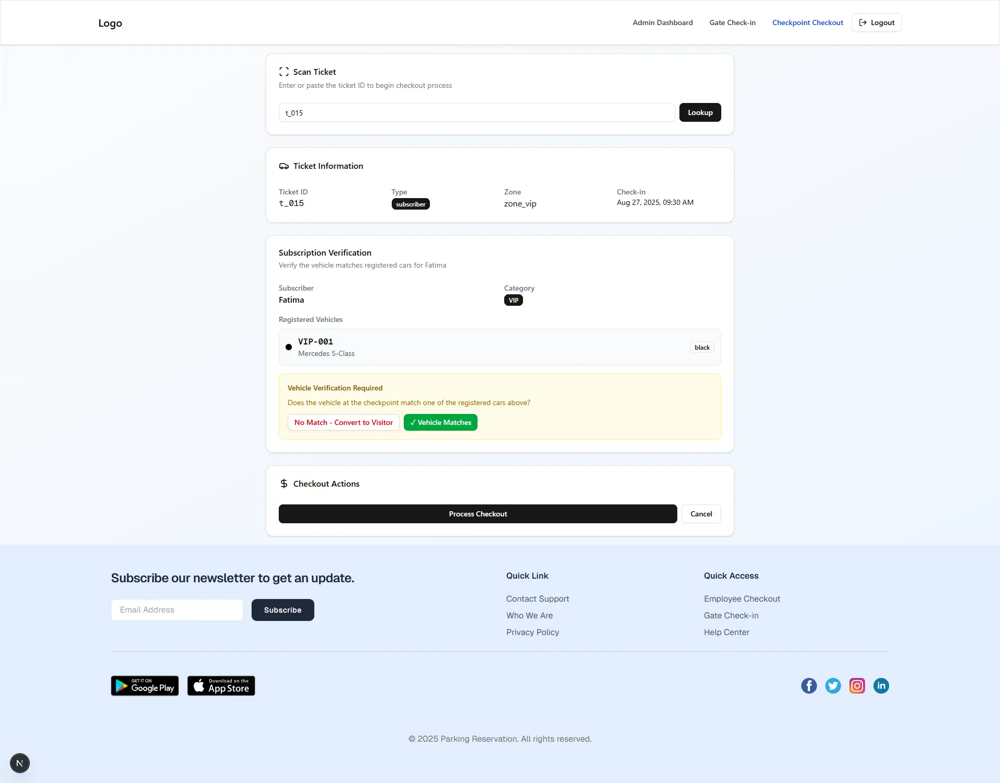
  <br /> 

   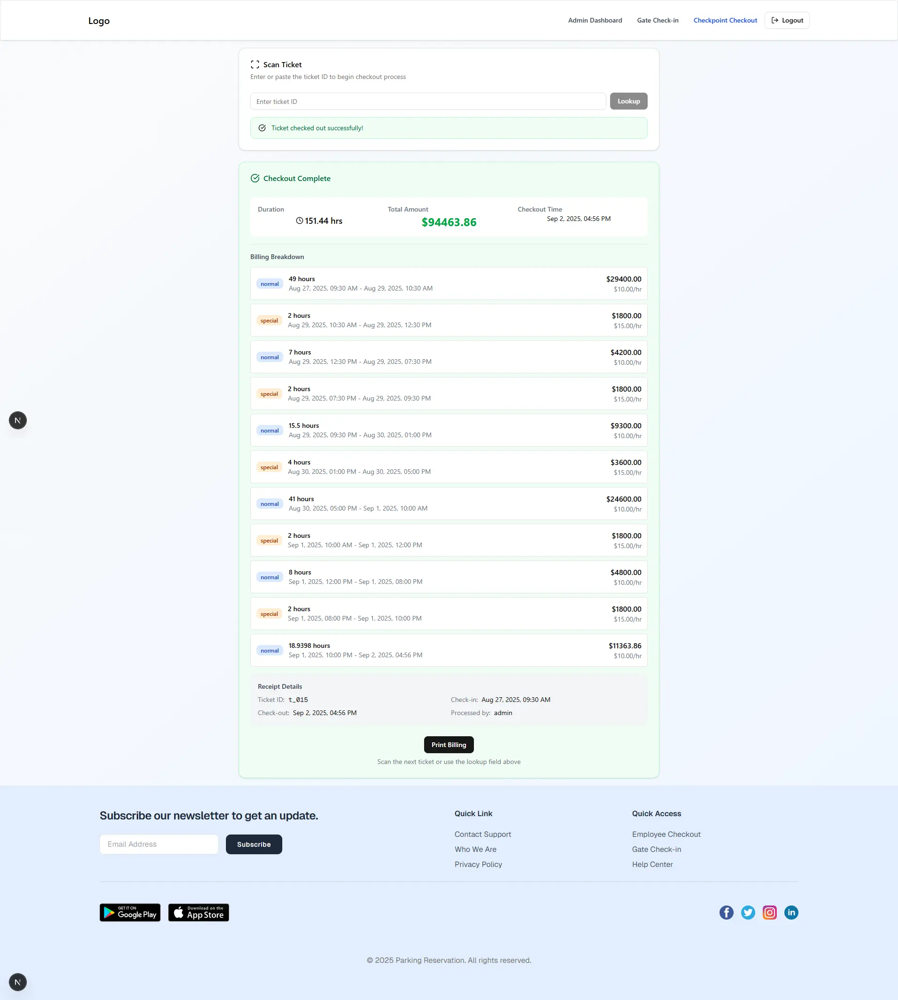
  <br /> 

   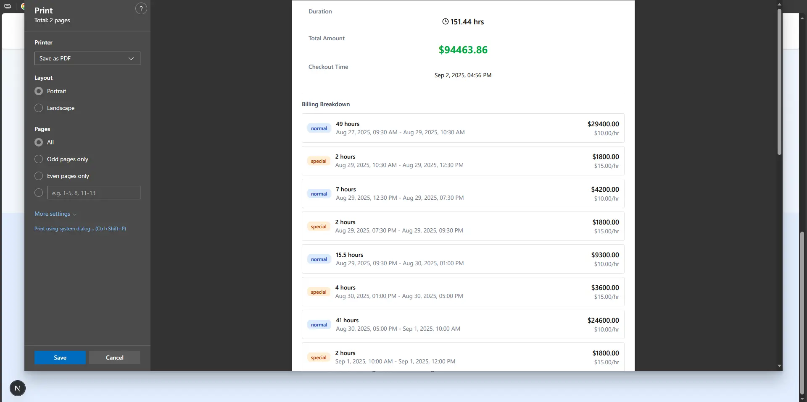